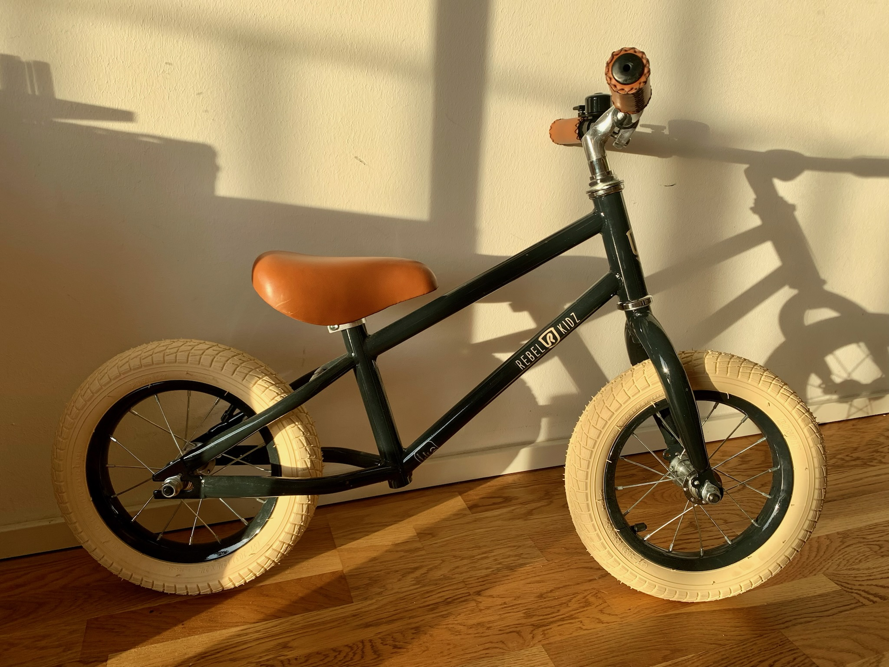

# Learning Github & Markdown
First repo 

# List in Md.

## Order List.

1. First item
2. Second item

## Unorder list.

- Item 1
- Item 2

## Link.
[This is a link](https://www.markdownguide.org/cheat-sheet/)

## Adding img




## Code
### Code line

We add a `line` of code

### Code block
```js
let cohort = "Boldo";
```

### test


